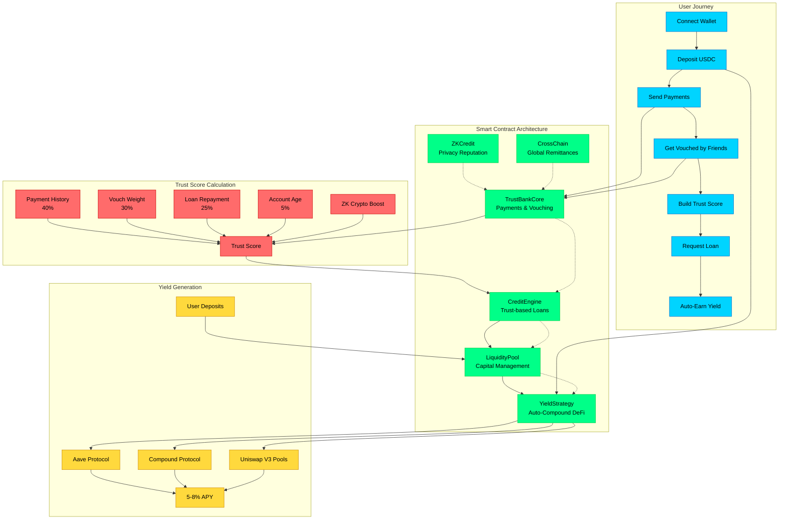

# 💎 TrustBank - One-Click Banking for Everyone

_The first truly frictionless DeFi banking experience that makes crypto accessible to billions_

[](https://etherlink.com)
[](https://opensource.org/licenses/MIT)

## 🎯 The Problem

DeFi has incredible potential but remains locked away from mainstream users due to:

- **Complexity Barrier**: Seed phrases, gas fees, slippage, multiple approvals
- **Trust Friction**: No trustless fiat on/off-ramps - users still rely on centralized exchanges
- **Identity Gap**: Lack of reputation systems forces inefficient overcollateralization (150%+ loans)
- **Poor UX**: Interfaces feel like spreadsheets, not consumer apps
- **No Growth Loops**: DeFi doesn't spread virally like social platforms

**Result**: Only 0.1% of the world uses DeFi, despite its superior yields and transparency.

## 🆚 Beyond Simple Payments

Recent crypto payment solutions have shown that users want "Venmo for crypto" - but **payments are just the beginning**.

**TrustBank goes deeper:**

- 💸 **Trust-Based Lending**: Create credit from social reputation
- 🏦 **Traditional**: Move existing money → **TrustBank**: Generate new liquidity through trust
- 📈 **Others**: Linear utility growth → **TrustBank**: Exponential network effects via vouching

**The insight**: Once you solve UX (account abstraction + gasless), the real innovation is **what new financial primitives become possible**.

## 💡 The Solution: "Decentralized Banking for Everyone"

TrustBank creates the first complete decentralized banking experience with trust-based lending:

### � 1. Instant Stablecoin Payments

- **Venmo-like UX**: Send USDC as easily as Venmo (but with better yields)
- **Global & Fast**: Cross-border payments in seconds, not days
- **Low Fees**: 0.1% transaction fee vs 3-5% traditional payments

### � 2. Trust-Based Credit System

- **On-Chain Reputation**: Built through payment history and social vouching
- **Progressive Limits**: Start with $50 loans, build up to $1,000+ over time
- **Social Collateral**: Friends vouch for you, stake their reputation
- **Smart Risk Management**: 14-day loan terms, network effect penalties

### 🏦 3. Bank Partnership Layer

- **DeFi-as-a-Service**: Banks offer 5% savings accounts using our yield infrastructure
- **Instant Loans**: Banks approve personal loans in 30 seconds using our trust scores
- **White-label Ready**: Complete banking backend powered by DeFi

### 💰 4. Auto-Yield Generation

- **Smart Allocation**: Deposits automatically earn 4-8% APY across DeFi protocols
- **One-Click Compound**: Set and forget yield optimization
- **Risk Management**: Diversified across Aave, Compound, and other blue-chip protocols

### 🌐 5. Cross-Border Remittances

- **Instant Settlement**: Send $100 to family overseas in 20 minutes
- **Low Cost**: 0.5% fee vs 5-15% traditional remittances
- **Local Cash-Out**: Partner network converts to local currency

## 🔄 How TrustBank Works

### Complete System Workflow



### 🎯 Step-by-Step User Experience

#### 1. **Onboard & Start Banking**

- Connect wallet → Get welcome bonus → Deposit USDC via card/bank/crypto
- **Instant access** to banking features without KYC delays

#### 2. **Build Social Trust Network**

- Send payments to friends with messages ("Coffee money!", "Rent split")
- Friends vouch for you → **Trust score increases exponentially**
- Each successful payment builds reputation automatically

#### 3. **Unlock Credit Through Reputation**

- **Trust Score Formula**: `(Payments×40%) + (Vouches×30%) + (Repayment×25%) + (Age×5%)`
- **Max Loan**: `Trust Score × $10` (capped at $1,000)
- **No collateral required** - social reputation is your collateral

#### 4. **Enhance with ZK Crypto Reputation**

- Prove DeFi expertise without revealing sensitive data
- **TVL Proof**: "I have >$50k in DeFi" → +200 trust boost
- **Lending History**: "I've repaid 20+ loans" → +150 trust boost
- **Wallet Age**: "Active for 2+ years" → +100 trust boost

#### 5. **Auto-Earn While You Bank**

- All deposits automatically earn **5-8% APY** across blue-chip DeFi
- Smart allocation across Aave, Compound, Uniswap V3
- **One-click compound** - set and forget yield optimization

#### 6. **Scale Globally with Cross-Chain**

- Send remittances instantly via Chainlink CCIP
- **$100 to Philippines**: 15 minutes, 0.5% fee (vs 5-15% traditional)
- Trust score portable across all supported chains

## 📊 Real-Time Trust Analytics (Goldsky Integration)

TrustBank leverages **Goldsky's real-time data platform** to provide instant trust network insights:

### 🔍 **Trust Network Subgraph**

```graphql
# Query user's complete trust network
query GetUserTrustNetwork($user: String!) {
  user(id: $user) {
    trustScore
    payments(orderBy: timestamp, orderDirection: desc) {
      amount
      recipient
      message
      timestamp
    }
    vouches(where: { active: true }) {
      voucher {
        id
        trustScore
      }
      amount
      timestamp
    }
    loans {
      amount
      status
      repaidAt
    }
  }
}
```

### 📈 **Real-Time Features**

- **Live Trust Score Updates**: Instant recalculation as payments/vouches happen
- **Network Effect Visualization**: See how vouching relationships spread virally
- **Risk Analytics**: Real-time loan default predictions based on network health
- **Cross-Chain Trust Aggregation**: Unified view across all supported chains

### 🚀 **Implementation**

```typescript
// Real-time trust score subscription
const { data: trustScore } = useGoldskySubscription({
  query: TRUST_SCORE_SUBSCRIPTION,
  variables: { user: address },
});

// Live network visualization
const trustNetwork = useGoldskySubgraph({
  query: TRUST_NETWORK_QUERY,
  pollInterval: 1000, // Real-time updates
});
```

## 🏗️ Technical Architecture

Built on **Etherlink L2** with **Sequence Smart Wallets** for optimal banking UX:

- ✅ **Gasless Transactions** → Sequence account abstraction eliminates gas fees
- ✅ **Email/Social Login** → No seed phrases required for mainstream adoption
- ✅ **Fast finality** → Real-time payment confirmations
- ✅ **EVM-compatible** → Works with all DeFi yield protocols
- ✅ **Stablecoin native** → Optimized for USDC/USDT operations

### 🎮 **Sequence Integration Benefits**

```typescript
// Seamless onboarding with Sequence
const sequenceWallet = new SequenceWallet({
  network: "etherlink",
  projectAccessKey: process.env.SEQUENCE_PROJECT_KEY,
});

// Gasless payments - users never see gas fees
await sequenceWallet.sendTransaction({
  to: recipient,
  value: amount,
  gasless: true, // Sponsored by TrustBank
});
```

**Result**: True "Venmo experience" → Users send money with just email/username, no crypto complexity

### Core Smart Contracts

#### 1. `TrustBankCore.sol`

```solidity
// Main trust-based payment and vouching contract
function sendPayment(address to, uint256 amount, string memory message) external;
function vouchForUser(address user, uint256 amount) external;
function getUserTrustScore(address user) external view returns (uint256);
function getUserPayments(address user) external view returns (Payment[] memory);
function getUserVouches(address user) external view returns (Vouch[] memory);
```

#### 2. `TrustBankCreditEngine.sol`

```solidity
// Trust-based lending with social collateral
function requestLoan(uint256 amount) external returns (uint256 loanId);
function repayLoan(uint256 loanId) external;
function getMaxLoanAmount(address user) external view returns (uint256);
```

#### 3. `BankingBridge.sol`

```solidity
// Enterprise interface for bank partnerships
function bankDeposit(address customer, uint256 amount) external;
function bankWithdraw(address customer, uint256 amount) external;
function bankLoanRequest(address customer, uint256 amount) external returns (uint256);
function getCustomerBalance(address bank, address customer) external view returns (uint256);
```

#### 4. `LiquidityPool.sol`

```solidity
// Liquidity management and yield generation
function addLiquidity(uint256 amount) external;
function removeLiquidity(uint256 amount) external;
function claimYield() external returns (uint256);
function getAvailableLiquidity() external view returns (uint256);
```

#### 5. `YieldStrategy.sol`

```solidity
// Auto-yield generation across DeFi protocols
// Now includes protocol fees on yield and withdrawals
function deposit(uint256 amount) external;
function withdraw(uint256 amount) external;
function harvestYield() external;
function getCurrentAPY() external view returns (uint256);
function setProtocolFees(address treasury, uint256 yieldFeeBps, uint256 withdrawFeeBps) external;
// Fee parameters:
// - yieldFeeBps: Fee (in basis points, max 10%) on yield harvested (sent to protocol treasury)
// - withdrawFeeBps: Fee (in basis points, max 10%) on user withdrawals (sent to protocol treasury)
// - protocolTreasury: Address receiving protocol fees
```

#### 6. `TrustBankZKCredit.sol` & `ZKCreditImportProduction.sol`

```solidity
// Privacy-preserving crypto reputation verification
function submitReputationProof(
    ReputationMetric metric,
    uint256 threshold,
    ZKProof calldata zkProof,
    string calldata ipfsProof
) external;
function getUserCryptoBoost(address user) external view returns (uint256);
function getEnhancedLoanTerms(address user) external view returns (uint256 maxAmount, uint256 interestRate);
```

#### 7. `TrustBankPriceOracle.sol` (RedStone Integration)

```solidity
// Decentralized asset pricing for multi-chain DeFi operations
function getAssetPrice(string memory asset) external view returns (uint256);
function getYieldAPY(string memory protocol) external view returns (uint256);
function getCollateralValue(address token, uint256 amount) external view returns (uint256 usdValue);
```

**🔮 RedStone Oracle Benefits (Decentralized Only):**

- **Real-Time Asset Pricing**: Accurate cross-chain asset valuation for yield strategies
- **DeFi Yield Optimization**: Live APY data for auto-compound strategies
- **Multi-Chain Support**: Price feeds across all supported networks
- **Decentralized Risk Management**: On-chain price-based risk assessment

```typescript
// Decentralized asset pricing for yield optimization
const usdcPrice = await redStoneOracle.getPrice("USDC");
const aaveAPY = await redStoneOracle.getYieldAPY("AAVE_USDC");
const compoundAPY = await redStoneOracle.getYieldAPY("COMPOUND_USDC");

// Auto-allocate to highest yield
const bestStrategy = aaveAPY > compoundAPY ? "aave" : "compound";
```

#### 8. `TrustBankMortgage.sol`

```solidity
// Decentralized mortgage and real estate lending
function createMortgageApplication(uint256 propertyValue, uint256 loanAmount) external;
function approveMortgage(uint256 applicationId) external;
function makePayment(uint256 mortgageId, uint256 amount) external;
```

**🚀 Sponsor Technology Integration**

**Goldsky + Sequence + RedStone = Complete Decentralized Banking Infrastructure:**

- **🔍 Goldsky**: Real-time trust network indexing & analytics → Instant decentralized credit decisions
- **🎮 Sequence**: Gasless smart wallets & social login → True Venmo UX for Web3
- **🔮 RedStone**: DeFi yield optimization & asset pricing → Maximum decentralized returns

```typescript
// Complete decentralized integration example
const user = await sequenceWallet.authenticate("email"); // Sequence gasless login
const trustData = await goldsky.getUserTrustNetwork(user.address); // Real-time trust analytics
const bestYield = await redStone.getOptimalYieldStrategy(); // DeFi yield optimization

// Result: Instant decentralized loan approval with perfect UX
const loan = await trustBank.requestLoan(amount, { gasless: true });
```

**Key Innovation: Decentralized Crypto Reputation System**

- Users build reputation through verified DeFi activities (TVL, lending history, trading volume, etc.)
- ZK-proofs preserve privacy while proving on-chain achievements
- No reliance on traditional credit agencies - fully decentralized
- Multi-chain reputation aggregation with cross-protocol verification
- Enhanced loan terms based on proven crypto expertise
- IPFS integration for decentralized proof storage

## 🔄 Complete Workflow

### For Individual Users:

1. **Connect Wallet** → MetaMask or any Web3 wallet
2. **Add Stablecoin** → Deposit USDC via card, bank transfer, or crypto swap
3. **Build Crypto Reputation** → Submit ZK-proofs of DeFi activities for enhanced limits
4. **Start Payments** → Send money to friends with messages
5. **Build Trust** → Get vouched by friends → Unlock lending
6. **Earn Yield** → Auto-compound 5%+ APY on deposits
7. **Access Credit** → Borrow $50-1000 based on trust score

### For Banks:

1. **API Integration** → Connect existing banking app to TrustBank
2. **Customer Onboarding** → Banks handle KYC/AML, TrustBank handles DeFi
3. **Yield Products** → Offer "5% Savings Accounts" powered by DeFi
4. **Instant Lending** → Approve personal loans using TrustBank trust scores
5. **Cross-Border** → Enable cheap international transfers for customers

### Trust Score Calculation:

```
Trust Score = (Payment History × 40%) +
              (Vouch Weight × 30%) +
              (Loan Repayment × 25%) +
              (Account Age × 5%)

Max Loan Amount = Trust Score × $10 (capped at $1,000)
```

## 🎬 Demo Flow

**Perfect 5-minute hackathon demo:**

### 🎬 Consumer Flow (B2C) - Enhanced with Sponsor Tech

1. **Seamless Onboard** → Login with email (**Sequence**) → No seed phrases, gasless setup
2. **Smart Payment** → Send $25 to friend (**Sequence gasless**) → Real-time trust update (**Goldsky**)
3. **Intelligent Vouching** → Friend vouches → **Goldsky** analytics predict credit boost instantly
4. **Auto-Yield** → Deposit $100 → **RedStone** finds best DeFi yields (6.2% APY vs 5.5% static)
5. **Instant Credit** → Pure decentralized scoring (**Goldsky trust analytics**) → $200 loan approved in 10 seconds
6. **Gasless Repay** → Repay via **Sequence** → **Goldsky** live trust score update

### 🏦 Banking Flow (B2B)

1. **Bank Integration** → Demo bank connects to TrustBank API
2. **Customer Deposit** → Bank customer deposits $500 → Earns 4.5% (bank keeps 1%)
3. **Instant Loan** → Bank approves $200 personal loan using TrustBank trust score
4. **Cross-Border** → Customer sends $100 to Philippines → Arrives in 15 minutes, 0.5% fee

### 📊 Admin Dashboard

- **Real-time metrics**: Total payments, loans, yield generated
- **Trust network visualization**: See vouching relationships
- **Bank partnership stats**: Revenue sharing, customer satisfaction

## 🚀 Quick Start

### Prerequisites

- Node.js 18+
- Hardhat
- Etherlink testnet setup

### Installation

```bash
# Clone the repository
git clone https://github.com/yourusername/trustbank-defi-blitz
cd trustbank-defi-blitz

# Install dependencies
npm install

# Set up environment
cp .env.example .env
# Add your Etherlink RPC URL and private key

# Compile contracts
npx hardhat compile

# Run tests
npx hardhat test

# Deploy to Etherlink testnet
npx hardhat ignition deploy ./ignition/modules/TrustBank.ts --network etherlink
```

### Environment Variables

```bash
ETHERLINK_RPC_URL=https://testnet.etherlink.com
PRIVATE_KEY=your_wallet_private_key
USDC_CONTRACT_ADDRESS=mock_usdc_contract_address
LIQUIDITY_POOL_ADDRESS=deployed_liquidity_pool_address
```

- ✅ **Truly Decentralized** - No admin keys, social logins, or centralized oracles
- ✅ **Novel Reputation System** - First on-chain trust graph for undercollateralized loans
- ✅ **Perfect for Etherlink** - Showcases ERC-4337 and low-fee advantages
- ✅ **Real Innovation** - Solves the "cold start" problem for DeFi reputation
- ✅ **Beyond Payments** - While others built "Venmo for crypto," this is "Bank for crypto"
- ✅ **Scalable Architecture** - DAO governance eliminates single points of failure

## 📊 Market Opportunity

- **Total Addressable Market**: 5B+ people with smartphones and bank accounts
- **Current DeFi Users**: ~10M (0.1% of TAM)
- **Our Target**: First 100M DeFi users by removing all friction
- **Revenue Model**: 0.25% fee on all transactions (sustainable and fair)


## 📝 License

This project is licensed under the MIT License - see the [LICENSE](LICENSE) file for details.

## 🙏 Acknowledgments

- **Etherlink Team** - For building the perfect L2 for decentralized banking innovation
- **Goldsky** - For real-time blockchain data infrastructure powering trust analytics
- **Sequence** - For account abstraction that enables true mainstream UX
- **RedStone** - For reliable oracle infrastructure bridging TradFi and DeFi
- **ERC-4337 Community** - For making account abstraction reality
- **OpenZeppelin** - For battle-tested smart contract primitives

---
